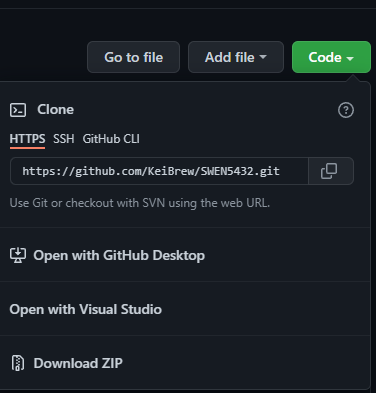
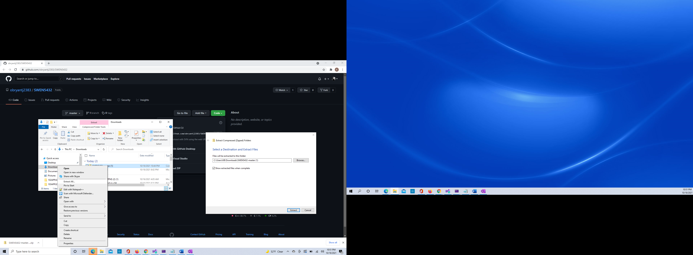
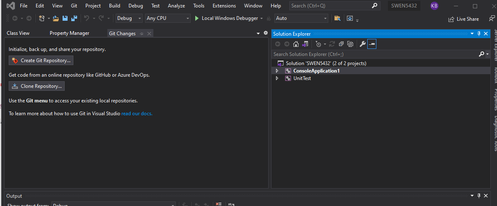

# SWEN 5432 – Project Assignment 
University of Houston – Clear Lake
Fall 2021

## Members/Developers
- Yacoub Kane - KaneY2347@UHCL.edu
- Keith Brewer – brewerK4597@UHCL.edu
- Joe O’Bryant - obryantj2383@UHCL.edu
- Vignesh Chandran Balan - chandranbalav0955@UHCL.edu

## Instructions

*1- Requirements: If you do not have Visual Studio 2019 installed, make sure you download it. Here you can find a link to download VS Code: Download Visual Studio 2019 for Windows & Mac (microsoft.com) https://visualstudio.microsoft.com/downloads/
To download source code – Please Visit GitHub repo at - [https://github.com/obryantj2383/SWEN5432](https://github.com/obryantj2383/SWEN5432)*

- Once arrived at link above click on “Code” Button.  If familiar with tool, please click option of “Open with Visual Studio” or “Open with Github Desktop”. If Unfamiliar with git tools or VS studio.  Click “Download ZIP”  

- Once file is downloaded, right click on “Extract All” option.  Once selected, selection destination and extract files once pop up window is displayed.  

- Once file is downloaded, double-click on object labeled “SWEN 5432”.  This should automatically open project in Visual Studio.  

- Once project Is loaded into Visual Studio click “Local Windows Debugger” to run prototype of product.  *(Please note that changing configuration may need to take place.  This can be done by changing options in combo box next to run prototype).*

- After successfully performing this step, executable form should be available in directory after successful compiling of source code.
